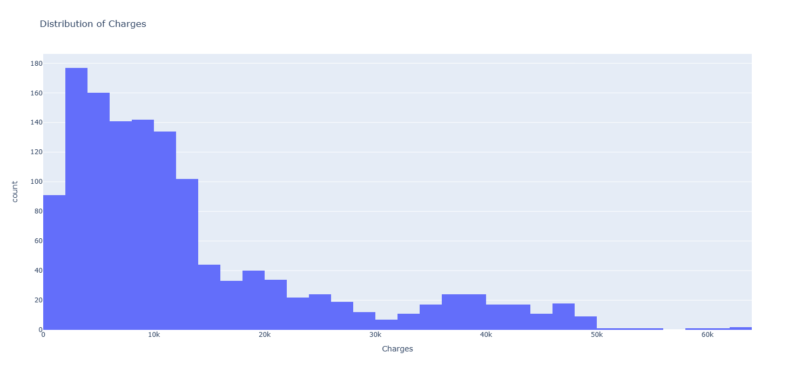
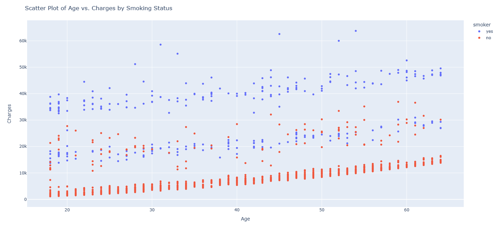
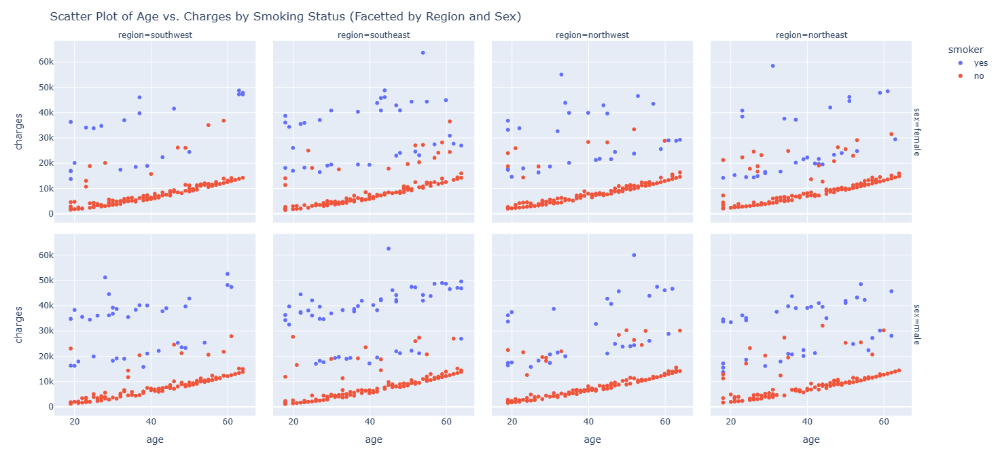
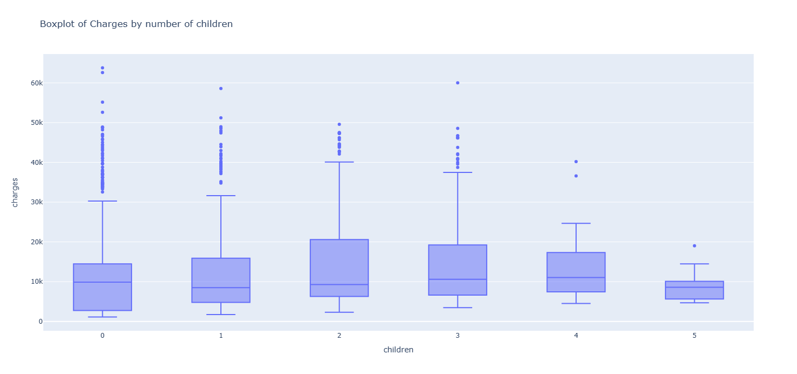
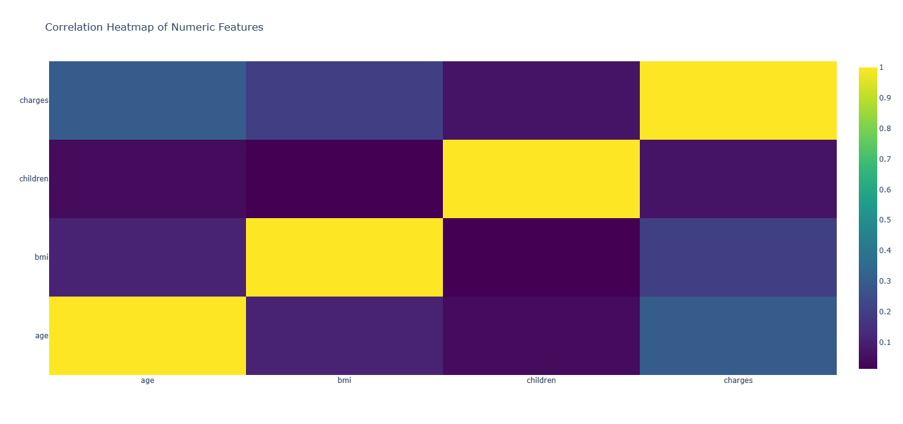
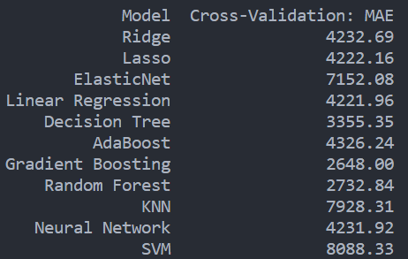
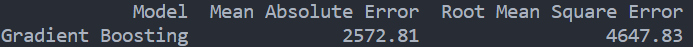

# Estimating Healthcare Insurance Expenses Machine Learning

### Background
Used machine supervised learning (ML) methods to predict Healthcare Insurance expenses for individuals. Using ML methods help insurance providers to  accurately estimate cost to help with premiums and pricing policies. 

### Data
The dataset has 1,338 observations and contains 7 variables such as `Age`, `Sex` (Female, Male), `BMI`, number of `children`, `smoker` (yes, no), `region` (southwest, southeast, northwest, northeast), and the `Charges`.

### Data Wrangling/Preprocessing
The dataset does not have any NA values. In this dataset, it is assume that every observations is for a different individual. The data set contains one duplicate observation which is remove for the analysis. For the variables `Sex` and `Smoker` it is converted to binary variable and the variable `Region` is converted using one-hot encoding.

### Exploratory data analysis plots

Here we start looking at the patterns, distributions, and predictors relationships to the response `Charges`.

The plots below show the distribution of the `Charges` variables which is skewed to the right.

The plots shows relationship between `Age` vs `Charges` by individual smoking status. There seems to be 3 cluster. People who do not smoke, the expensive are the less than those who do smoke.

There is a similarly pattern when looking at each `region` and `region` with `Sex`. 

The boxplot gives the distribution of `Charges` vs the number of `Children`.

The correlations plots show that is there is only positive associations between numeric variables.

 
 
### Model Building

The data was split 80/20 for training and testing sets. Performed cross-validation 5-fold on 11 models to determine the optimal model. 

The results are shown below where the Gradient Boosting model has the smallest mean absolute error on the training dataset.

### Prediction / Evaluating model
The Gradient Boosting model was used to predict the values from test set. The table below shows the MAE and RMSE. 

### Summary
The Gradient Boosting model MAE is 2572.81. Meaning the models is off by 2572 dollars. Overall the model is good but it can be improve to reduce the error.

